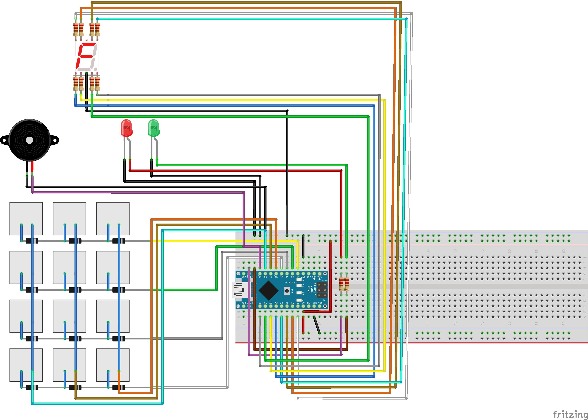
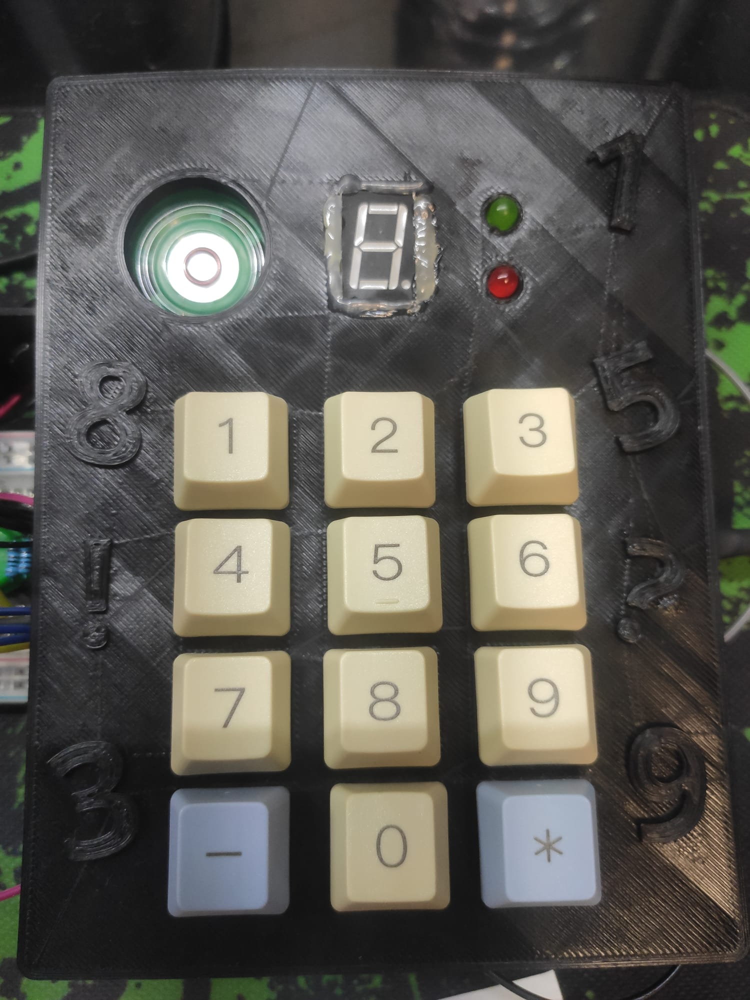

# Simon Says Interaction

The Simon Says Interaction is a mini game that was developed for my Master Thesis "Developing a Support Infrastructure for an Escape The Room and Peddy Paper Games".

This mini game, or interaction as I so call it, was developed to be part of an Escape the Room game that was also developed as part of my thesis. Since this interaction can work as a standalone mini game I decided to place it here for anyone interested in using it.

## List of Components

- Otemu Mechanical Switch (12x);
- Diode 1n4148 (12x);
- Red LED (1x);
- Green LED (1x);
- Piezzo Speaker (1x);
- 7-Segment Display (1x);
- 220Ω Resistor (10x);
- Arduino Nano (1x);

In order to fully assemble the Interaction, so as to look like the picture below, you will also need to 3D Print the enclosure which is divided into two parts that can be found [here](enclosure/). Additionally, you will also need to 3D Print the keycaps which were not designed by me but can be found in [Thingiverse](https://www.thingiverse.com/thing:2783650).

## The Purpose of The Game

The Simon Says Interaction is the classic memory game mixed up with pattern recognition in a light sense. The way this mini game works is that on the 7-Segment display, a series of numbers will appear in increasingly hard sequences that have to be reproduced but the tricky part that the player will have to realize is that only the numbers that appear with the dot on the display lit are the ones that should be introduced.

### Example

Lets say for example that the following numbers appear on the display:

- > 7 9. 3 5. 0. 3 6 1.

What the player would have to introduce in order to solve this mini game would be the numbers 9, 5, 0 and 1 in this order. When they achieve this the green LED will light up and a success sound will be played to symbolize that the player has won.

## Intructions 

First start by uploading the code to your Arduino Nano (This is the one I used so I can only guarantee proper working with this micro-controller).

### Starting the Game

To start the game you must first type in the Arduino IDE serial monitor the following:

- > COM:START;ID:123456789

This command will then print in the Serial Monitor the solution of the game which then needs to be introduced using the keypad. If the introduced code is correct then the following message will appear in the serial monitor:

- > COM:INTERACTION_SOLVED;MSG:User Introduced Correct Patterns;PNT:1500

## Warning

The source code for this interaction contains a lot of logic that was made to communicate with the infrastructure that was developed for my thesis and therefor it is not as clean as it could be when compared to a mini game that is developed with the intent of being used by the Arduino IDE directly.